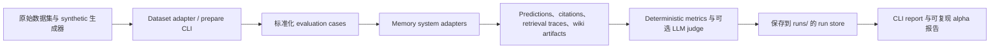

# Wiki-Memory-Bench

[](https://github.com/userljz/wiki-memory-bench/actions/workflows/ci.yml)
[](LICENSE)
[](pyproject.toml)

Benchmark Markdown/Wiki memory systems for LLM agents.

> v0.1-alpha。一个面向工程实践的、可复现且尽量诚实的 LLM Agent 记忆系统评测框架。

## 它解决什么问题

很多 agent memory system 都会声称自己能：

- 长期记住事实
- 更新过时信息
- 给出可追溯的引用
- 忘掉临时或不该保留的信息

这类说法在 wiki-style / Markdown-first memory 系统里尤其常见，因为它们强调的是“可检查、可编辑、可本地保存”的记忆载体，而不是黑盒状态。

`wiki-memory-bench` 的目标，是把这些说法变成可复现的工程评测。它提供一套 CLI harness，用统一 schema 规范化数据集，运行可对比的 baseline，把 artifacts 存到 `runs/`，并报告 answer accuracy、citation precision、token 用量、延迟和诊断元数据。

## 它有什么不同

- `Markdown / Wiki memory`：项目明确针对把记忆编译成 Markdown 页面、wiki 笔记或类似本地 artifact 的系统。
- `人工精选 clips`：不仅支持完整原始历史，也支持“人类实际会保留下来”的 clips / sessions。
- `stale claim 与 update diagnostics`：synthetic 任务会显式覆盖更新、矛盾、过时 claim 和 forgetting 行为。
- `evidence-aware citation metrics`：不仅看答对没有，也看 source precision/recall/F1、stale citations、unsupported answers；没有 source id 时才回退到 quote matching。
- `token / latency tracking`：每次 run 都记录检索成本、token 估计和延迟，便于看工程权衡。
- `可复现 CLI harness`：评测流程由 `uv` + Typer CLI、标准化 adapter、保存下来的 artifacts 和显式报告驱动。

## 5 分钟快速开始

### 核心路径：不需要 API key

这是最快跑通一次真实 benchmark 与 report 的路径。

```bash
uv sync
uv run wmb datasets list
uv run wmb systems list
uv run wmb run --dataset synthetic-mini --system bm25 --limit 5
uv run wmb report runs/latest
```

默认情况下，`wmb run` 是 fail-fast：system、evaluation 或 judge 抛异常会立刻终止。
如果要做批量诊断，可以使用 `--continue-on-error`；runner 会继续后续样本，把失败样本写入
`predictions.jsonl`，把 traceback 保存到 `artifacts/errors/`，并在 summary 中报告
`error_count` / `error_rate`。

如果你想跑一个更接近 wiki-memory 场景、但依然不需要 API key 的诊断路径：

```bash
uv run wmb synthetic generate --cases 100 --out data/synthetic/wiki_memory_100.jsonl
uv run wmb run --dataset synthetic-wiki-memory --system clipwiki --limit 50
uv run wmb report runs/latest
```

### 可选向量路径

只有在你要运行 `vector-rag` 时，才需要安装可选向量依赖。

```bash
uv sync --extra vector
uv run wmb datasets prepare locomo-mc10 --limit 20
uv run wmb run --dataset locomo-mc10 --system vector-rag --limit 20
uv run wmb report runs/latest
```

### 可选 LLM 路径

只有在你要使用 LLM answerer 或 LLM judge 时，才需要安装可选 LLM 依赖。

```bash
uv sync --extra llm
export LLM_MODEL="openrouter/tencent/hy3-preview:free"
export LLM_API_KEY="your-openrouter-api-key"
# 可选：本地 OpenAI-compatible endpoint
export LLM_BASE_URL="http://localhost:8000/v1"

uv run wmb run --dataset locomo-mc10 --system clipwiki --answerer llm --judge deterministic --limit 2
uv run wmb report runs/latest --show-prompts
```

通过 LiteLLM 使用 OpenRouter 时，`LLM_MODEL` 里保留 `openrouter/` 前缀。
如果没有设置 `LLM_API_KEY` 或 `LLM_BASE_URL`，也可以分别用
`OPENROUTER_API_KEY` 和 `OPENROUTER_API_BASE` 作为回退配置。低成本校准建议先用
`--judge deterministic`；`--judge llm` 会额外调用模型。

### 可选 LLM smoke

可选 LLM smoke 是手动校准流程，和下面的 deterministic alpha 结果分开解释。
它不会在普通 `push` 或 `pull_request` CI 中运行，并且脚本会拒绝在缺少
`WMB_RUN_LLM_INTEGRATION=1`、`LLM_MODEL`、`LLM_API_KEY` 的情况下执行。

```bash
uv sync --group dev --extra llm --extra vector
export WMB_RUN_LLM_INTEGRATION=1
export WMB_LLM_LIMIT=20
export LLM_MODEL="openrouter/tencent/hy3-preview:free"
export LLM_API_KEY="your-openrouter-api-key"
bash scripts/reproduce_llm_smoke.sh
```

生成的校准报告在 [`reports/llm-smoke-results.md`](reports/llm-smoke-results.md)，
旁路数据文件为 `reports/.llm_smoke_results.jsonl` 和
`reports/llm-smoke-run-ids.txt`。这些行受模型和 provider 行为影响，不应和
deterministic alpha rows 混成同一个 leaderboard。

可选的 LLM calibration 路径见 [`docs/llm-evaluation.md`](docs/llm-evaluation.md)。

## v0.1-alpha 结果快照

当前可复现的 alpha 报告在 [`reports/v0.1-alpha-results.md`](reports/v0.1-alpha-results.md)。其中包含 `evaluated_source_commit`、`report_generated_at`、`source_tree_status_at_generation`、`report_file_commit_note`、精确命令、vector-rag 状态、gold-label 使用情况、run ID、依赖模式和 failure analysis。

如果你想看更偏公共数据集的 alpha slice，并且把 non-oracle 行和 oracle upper bound 分开看，请参考 [`reports/public-benchmark-alpha.md`](reports/public-benchmark-alpha.md)。

下面这张表是 alpha 报告里 `Result Table` 的压缩摘要，刻意保持保守：

- 它混合了 smoke 行和 limited-slice alpha 行
- 它不是最终的 scientific leaderboard
- 它**不能**证明 `clipwiki` 在总体上优于 `vector-rag`
- 如果生成后的报告再被提交，后续 commit 可能包含报告文件本身，而 `evaluated_source_commit` 仍然表示实际被评测的源码 commit
- oracle rows 只是 upper bounds，不能纳入公平的 non-oracle 系统比较
- ClipWiki 的 `full-wiki` 和 `curated` 是 non-oracle mode；只有 `oracle-curated` 可以使用 gold evidence labels

| 数据集 | 系统 | Mode | Status | Uses Gold Labels | Dependency Mode | Accuracy | Citation Precision |
| --- | --- | --- | --- | --- | --- | ---: | ---: |
| `synthetic-mini` | `bm25` | `default` | `ok` | `no` | `core` | 100.00% | 80.00% |
| `synthetic-wiki-memory` | `bm25` | `default` | `ok` | `no` | `core` | 70.00% | 50.00% |
| `synthetic-wiki-memory` | `clipwiki` | `full-wiki` | `ok` | `no` | `core` | 70.00% | 60.00% |
| `locomo-mc10` | `bm25` | `default` | `ok` | `no` | `core` | 28.00% | 4.00% |
| `locomo-mc10` | `vector-rag` | `default` | `ok` | `no` | `vector-extra-installed` | 22.00% | 6.00% |
| `locomo-mc10` | `clipwiki` | `full-wiki` | `ok` | `no` | `core` | 30.00% | 4.00% |

当前 alpha 报告状态摘要：

- `vector-rag`：`ran`（`status=ok`，`dependency_mode=vector-extra-installed`）
- 使用 gold labels 的行：`none`

在当前 alpha 报告里，`locomo-mc10` 这几行都只是 citation precision 偏低的弱 alpha slice。它们应该被理解为某个时间点的工程快照，而不是“某个系统总体胜出”的证据。

## 已支持的数据集

| 数据集 | 别名 / 命令 | 状态 | 说明 |
| --- | --- | --- | --- |
| Synthetic Mini | `synthetic-mini` | Stable | 内置五条样例，适合做快速 sanity check。 |
| Synthetic Wiki Memory | `synthetic-wiki-memory` | Stable | 确定性 open-QA 诊断集，覆盖 update、stale claim、citation、aggregation 和 forgetting。 |
| LoCoMo-MC10 | `locomo-mc10` | Stable | 基于 `Percena/locomo-mc10` 的 10-choice 长对话 QA 数据集。 |
| LongMemEval-cleaned | `longmemeval-s`、`longmemeval-m`、`longmemeval-oracle` | Experimental 到 Stable（按 split） | 当前支持重点在 cleaned release 与标准化 prepare 流程。 |

常用数据集命令：

```bash
uv run wmb datasets prepare locomo-mc10 --limit 20
uv run wmb datasets prepare longmemeval --split s --limit 20
uv run wmb datasets prepare longmemeval --split m --sample 50
```

## 已支持的系统

| 系统 | 公共名称 | 说明 |
| --- | --- | --- |
| BM25 | `bm25` | 成本低、完全本地的 lexical baseline。 |
| Vector RAG | `vector-rag` | 本地 embedding 检索 baseline；需要安装可选 `vector` extra。 |
| ClipWiki | `clipwiki` | 确定性的 wiki-style baseline，会编译 source / evidence 页面再做检索。 |
| FullContext Oracle Upper Bound | `full-context-oracle` | oracle 上界。deterministic 模式会直接使用 gold label，**不是**公平的可部署 baseline。 |
| 实验性外部 adapters | 当前是 `basic-memory` | 适合工程评测，但可能运行在 fallback mode，需要如实标注。 |

兼容性说明：`full-context` 仍然保留为 `full-context-oracle` 的向后兼容别名。

## 架构



## 如何添加一个新的 Memory System

1. 在 `src/wiki_memory_bench/systems/` 下增加模块。
2. 继承 `SystemAdapter`。
3. 实现 `run()`，必要时实现 `prepare_run()` / `finalize_run()`。
4. 用 `@register_system` 注册。
5. 添加有针对性的回归测试，而不是只加 smoke path。
6. 至少补一条能真正落到 `runs/` 的 CLI 可运行路径。

最小结构：

```python
@register_system
class MyMemorySystem(SystemAdapter):
    name = "my-memory-system"
    description = "Short description."

    def prepare_run(self, run_dir: Path, dataset_name: str) -> None:
        ...

    def run(self, example: PreparedExample) -> SystemResult:
        ...
```

更完整的 checklist 见 `docs/adapter-guide.md`。

## 如何添加一个新的数据集

1. 在 `src/wiki_memory_bench/datasets/` 下增加模块。
2. 继承 `DatasetAdapter`。
3. 把原始数据转换成统一的 `EvalCase` schema。
4. 尽可能保留 timestamps、evidence metadata、source references 和 split 信息。
5. 用 `@register_dataset` 注册。
6. 补 fixture 驱动的测试和 CLI prepare smoke path。

最小结构：

```python
@register_dataset
class MyDataset(DatasetAdapter):
    name = "my-dataset"
    description = "Short description."

    def load(self, limit: int | None = None, sample: int | None = None) -> PreparedDataset:
        ...
```

规范化 schema 与 split 规则见 `docs/dataset-guide.md`。

## 路线图

- 继续改进 `LongMemEval-cleaned` 上的 deterministic open-QA 抽取。
- 增加更强的 maintenance / patch correctness 诊断。
- 改进 evidence-aware citation 指标与 report 导出。
- 扩大 `longmemeval-m` 和 `longmemeval-oracle` 的 benchmark 覆盖。
- 持续改进 `clipwiki` 在 update / stale claim 场景下的编译与检索启发式。
- 增加更多实验性外部 adapters，并明确依赖模式与 fallback 模式。

## 已知限制

- 这是 `v0.1-alpha`，不是最终版 benchmark release。
- 当前一些行只是 small-limit smoke 或 alpha slice，而不是 exhaustive experiment。
- deterministic answerer 对可复现性有帮助，但可能低估或高估更强 learned answerer 的实际表现。
- `vector-rag`、LLM 模式等可选系统依赖额外依赖或 API 配置。
- 实验性外部 adapters 可能运行在 fallback mode；这类结果不应被表述成完整 integration benchmark。
- 当前公开 alpha 版本最强的是“可复现性与诚实呈现”，还不是“覆盖面最广”。

## 许可证与致谢

本仓库代码采用 MIT License，见 `LICENSE`。

被 benchmark 的数据集继续沿用各自的许可证、使用条款与再分发限制。外部项目和第三方库也继续沿用各自许可证。

相关数据集、系统和基础库的致谢见 `ACKNOWLEDGEMENTS.md`；具体数据集的 license 细节请再查看原始 dataset card。
