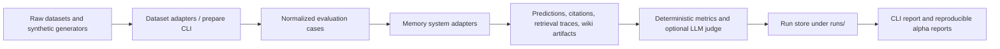

# Wiki-Memory-Bench

[](https://github.com/userljz/wiki-memory-bench/actions/workflows/ci.yml)
[](LICENSE)
[](pyproject.toml)

Benchmark Markdown/Wiki memory systems for LLM agents.

> v0.1-alpha. Honest, serious, engineering-focused evaluation for teams building agent memory systems.

## What Problem It Solves

Agent memory systems often claim they can:

- remember facts over time
- update stale facts
- cite where an answer came from
- forget temporary or unsafe information

Those claims are especially common for wiki-style or Markdown-first memory systems, where the promise is inspectable, editable, local state instead of opaque hidden memory.

`wiki-memory-bench` exists to make that claim testable. It provides a reproducible CLI harness that normalizes datasets, runs comparable baselines, saves artifacts under `runs/`, and reports answer accuracy, citation precision, token usage, latency, and diagnostic metadata.

## What Makes It Different

- `Markdown / Wiki memory`: The benchmark is designed for systems that compile or maintain memory as Markdown pages, wiki notes, or similar local artifacts.
- `Human-curated clips`: It can evaluate memory built from selected clips or sessions, not only full raw histories.
- `Stale-claim and update diagnostics`: Synthetic tasks exercise updates, contradictions, stale claims, and forgetting behavior.
- `Citation precision`: It tracks whether a system cites relevant evidence rather than only answering correctly.
- `Token and latency tracking`: Each run records retrieval cost, token estimates, and latency so practical trade-offs stay visible.
- `Reproducible CLI harness`: Runs are driven by `uv` + Typer CLI, normalized adapters, saved artifacts, and explicit reports.

## 5-Minute Quickstart

### Core path, no API key

This is the fastest path to a real run and report.

```bash
uv sync
uv run wmb datasets list
uv run wmb systems list
uv run wmb run --dataset synthetic-mini --system bm25 --limit 5
uv run wmb report runs/latest
```

If you want a slightly richer no-key diagnostic run:

```bash
uv run wmb synthetic generate --cases 100 --out data/synthetic/wiki_memory_100.jsonl
uv run wmb run --dataset synthetic-wiki-memory --system clipwiki --limit 50
uv run wmb report runs/latest
```

### Optional vector path

Install the optional vector stack only if you want `vector-rag`.

```bash
uv sync --extra vector
uv run wmb datasets prepare locomo-mc10 --limit 20
uv run wmb run --dataset locomo-mc10 --system vector-rag --limit 20
uv run wmb report runs/latest
```

### Optional LLM path

Install the optional LLM stack only if you want LLM answerers or LLM judges.

```bash
uv sync --extra llm
export LLM_MODEL="openrouter/tencent/hy3-preview:free"
export LLM_API_KEY="your-openrouter-api-key"
# Optional for local OpenAI-compatible endpoints
export LLM_BASE_URL="http://localhost:8000/v1"

uv run wmb run --dataset locomo-mc10 --system clipwiki --answerer llm --judge deterministic --limit 2
uv run wmb report runs/latest --show-prompts
```

For OpenRouter through LiteLLM, keep the `openrouter/` prefix in `LLM_MODEL`.
`OPENROUTER_API_KEY` and `OPENROUTER_API_BASE` are also accepted as fallbacks
when `LLM_API_KEY` or `LLM_BASE_URL` are not set. Use `--judge deterministic`
for low-cost calibration; `--judge llm` makes additional model calls.

### Optional LLM smoke

The optional LLM smoke path is a manual calibration workflow, separate from the
deterministic alpha results below. It is not part of normal `push` or
`pull_request` CI, and it refuses to run unless `WMB_RUN_LLM_INTEGRATION=1`,
`LLM_MODEL`, and `LLM_API_KEY` are configured.

```bash
uv sync --group dev --extra llm --extra vector
export WMB_RUN_LLM_INTEGRATION=1
export WMB_LLM_LIMIT=20
export LLM_MODEL="openrouter/tencent/hy3-preview:free"
export LLM_API_KEY="your-openrouter-api-key"
bash scripts/reproduce_llm_smoke.sh
```

The generated calibration report is written to
[`reports/llm-smoke-results.md`](reports/llm-smoke-results.md), with sidecars
at `reports/.llm_smoke_results.jsonl` and `reports/llm-smoke-run-ids.txt`.

Manual LLM calibration is documented in [`docs/llm-evaluation.md`](docs/llm-evaluation.md). Keep these rows separate from deterministic alpha results: they are optional calibration runs with provider-dependent behavior.

## v0.1-alpha Results

The current reproducible alpha report is [`reports/v0.1-alpha-results.md`](reports/v0.1-alpha-results.md). It records `evaluated_source_commit`, `report_generated_at`, `source_tree_status_at_generation`, a `report_file_commit_note`, exact commands, vector-rag status, gold-label usage, run IDs, dependency modes, and failure analysis.

For a broader public-dataset alpha slice that separates non-oracle rows from oracle upper bounds, see [`reports/public-benchmark-alpha.md`](reports/public-benchmark-alpha.md).

The table below is a condensed copy of the alpha report's `Result Table`. It is intentionally conservative:

- it mixes smoke rows and limited-slice alpha rows
- it is not a final scientific leaderboard
- it does **not** prove that `clipwiki` is generally better than `vector-rag`
- when a generated report is later committed, that later commit may contain the report file, while `evaluated_source_commit` remains the source code that was benchmarked

| Dataset | System | Mode | Status | Uses Gold Labels | Dependency Mode | Accuracy | Citation Precision |
| --- | --- | --- | --- | --- | --- | ---: | ---: |
| `synthetic-mini` | `bm25` | `default` | `ok` | `no` | `core` | 100.00% | 80.00% |
| `synthetic-wiki-memory` | `bm25` | `default` | `ok` | `no` | `core` | 70.00% | 50.00% |
| `synthetic-wiki-memory` | `clipwiki` | `full-wiki` | `ok` | `no` | `core` | 70.00% | 60.00% |
| `locomo-mc10` | `bm25` | `default` | `ok` | `no` | `core` | 28.00% | 4.00% |
| `locomo-mc10` | `vector-rag` | `default` | `ok` | `no` | `vector-extra-installed` | 22.00% | 6.00% |
| `locomo-mc10` | `clipwiki` | `full-wiki` | `ok` | `no` | `core` | 30.00% | 4.00% |

Current alpha report status summary:

- `vector-rag`: `ran` (`status=ok`, `dependency_mode=vector-extra-installed`)
- rows using gold labels: `none`

In the current alpha report, the `locomo-mc10` rows are all weak alpha slices with low citation precision. Read them as a point-in-time engineering snapshot, not as evidence that one system generally beats another.

## Supported Datasets

| Dataset | Alias / Command | Status | Notes |
| --- | --- | --- | --- |
| Synthetic Mini | `synthetic-mini` | Stable | Built-in five-case smoke benchmark for fast sanity checks. |
| Synthetic Wiki Memory | `synthetic-wiki-memory` | Stable | Deterministic open-QA diagnostics for update, stale-claim, citation, aggregation, and forgetting behavior. |
| LoCoMo-MC10 | `locomo-mc10` | Stable | 10-choice long-conversation QA backed by `Percena/locomo-mc10`. |
| LongMemEval-cleaned | `longmemeval-s`, `longmemeval-m`, `longmemeval-oracle` | Experimental to stable by split | Current support focuses on the cleaned release and normalized preparation flow. |

Common dataset commands:

```bash
uv run wmb datasets prepare locomo-mc10 --limit 20
uv run wmb datasets prepare longmemeval --split s --limit 20
uv run wmb datasets prepare longmemeval --split m --sample 50
```

## Supported Systems

| System | Public Name | Notes |
| --- | --- | --- |
| BM25 | `bm25` | Cheap local lexical baseline over session documents. |
| Vector RAG | `vector-rag` | Local embedding retrieval baseline; requires the optional `vector` extra. |
| ClipWiki | `clipwiki` | Deterministic wiki-style baseline that compiles source/evidence pages and retrieves them. |
| FullContext Oracle Upper Bound | `full-context-oracle` | Oracle upper bound. Deterministic mode uses gold labels and is **not** a fair deployable baseline. |
| Experimental external adapters | `basic-memory` today | External integrations are useful for engineering evaluation, but may run in fallback mode and should be reported honestly. |

Additional compatibility note: `full-context` remains a backward-compatible alias for `full-context-oracle`.

## Architecture



## How To Add a Memory System

1. Add a module under `src/wiki_memory_bench/systems/`.
2. Subclass `SystemAdapter`.
3. Implement `run()` and optional `prepare_run()` / `finalize_run()`.
4. Register it with `@register_system`.
5. Add focused regression tests, not only a smoke path.
6. Add at least one CLI runnable path that persists artifacts under `runs/`.

Minimal shape:

```python
@register_system
class MyMemorySystem(SystemAdapter):
    name = "my-memory-system"
    description = "Short description."

    def prepare_run(self, run_dir: Path, dataset_name: str) -> None:
        ...

    def run(self, example: PreparedExample) -> SystemResult:
        ...
```

See `docs/adapter-guide.md` for a fuller checklist.

## How To Add a Dataset

1. Add a module under `src/wiki_memory_bench/datasets/`.
2. Subclass `DatasetAdapter`.
3. Convert raw data into the normalized `EvalCase` schema.
4. Preserve timestamps, evidence metadata, source references, and split information where possible.
5. Register it with `@register_dataset`.
6. Add fixture-backed tests plus a CLI prepare smoke path.

Minimal shape:

```python
@register_dataset
class MyDataset(DatasetAdapter):
    name = "my-dataset"
    description = "Short description."

    def load(self, limit: int | None = None, sample: int | None = None) -> PreparedDataset:
        ...
```

See `docs/dataset-guide.md` for the schema contract and split handling rules.

## Roadmap

- Improve deterministic open-QA extraction on `LongMemEval-cleaned`.
- Add stronger maintenance / patch correctness diagnostics.
- Improve evidence-aware citation metrics and report exports.
- Expand benchmark coverage for `longmemeval-m` and `longmemeval-oracle`.
- Continue improving `clipwiki` compilation and retrieval heuristics for update/staleness scenarios.
- Add more experimental external adapters with honest dependency and fallback reporting.

## Known Limitations

- This is `v0.1-alpha`, not a final benchmark release.
- Some rows are small-limit smoke or alpha slices rather than exhaustive experiments.
- Deterministic answerers are useful for reproducibility, but they can understate or overstate what stronger learned answerers would do.
- Optional systems such as `vector-rag` and LLM modes depend on extra dependencies or API configuration.
- Experimental external adapters may run in fallback mode; those results should not be presented as full integration benchmarks.
- Current public alpha reporting is strongest on reproducibility and honesty, not on breadth of benchmark coverage.

## License and Acknowledgements

The code in this repository is licensed under the MIT License. See `LICENSE`.

Benchmarked datasets keep their own licenses, usage terms, and redistribution constraints. External projects and third-party libraries also keep their own licenses.

See `ACKNOWLEDGEMENTS.md` for related datasets, systems, and libraries, and see the original dataset cards for dataset-specific license details.
