# Wiki-Memory-Bench

Benchmark and evaluation harness for Markdown/Wiki-style long-term memory systems for LLM agents.

## Why This Exists
Most memory benchmarks focus on generic retrieval, context stuffing, or agent runtime behavior. That is useful, but it misses a specific class of systems that many AI engineers are now building:

- local Markdown memory stores
- wiki-style persistent memory
- human-curated clips instead of full raw logs
- update and maintenance workflows rather than retrieval alone

`wiki-memory-bench` exists to measure those systems directly. The goal is not only to ask whether a system can answer a question, but whether it can maintain a useful memory substrate over time:

- what it saves
- what it updates
- what it marks stale
- what it forgets
- what it cites

## What Makes It Different
Four design choices define this project:

### Markdown / Wiki memory systems
This project is centered on systems that compile memory into local Markdown or wiki-like artifacts, not just vector stores or opaque agent state.

### Human-curated clips
The benchmark explicitly supports curated memory inputs: the clips or sessions a human would actually choose to preserve, not only the full original conversation.

### Update / stale / citation metrics
The harness tracks more than answer accuracy. It is designed to evaluate:

- updates and knowledge changes
- stale claim handling
- citation quality
- forgetting behavior
- wiki artifact size and retrieval cost

### Reproducible harness
Everything is local-first and scriptable:

- `uv`
- Typer CLI
- JSONL prepared data
- saved run artifacts under `runs/`
- deterministic baselines by default
- optional LiteLLM-based answerer and judge when needed

Default quickstart does not require API keys.

## Quickstart
### Install

```bash
uv sync
uv run wmb datasets list
uv run wmb systems list
```

### Run the synthetic wiki-memory benchmark

```bash
uv run wmb synthetic generate --cases 100 --out data/synthetic/wiki_memory_100.jsonl
uv run wmb run --dataset synthetic-wiki-memory --system clipwiki --limit 50
uv run wmb report runs/latest
```

### Optional external adapter: Basic Memory

```bash
uv tool install basic-memory
uv run wmb systems doctor basic-memory
uv run wmb run --dataset synthetic-wiki-memory --system basic-memory --limit 20
```

### Run the LoCoMo-MC10 benchmark

```bash
uv run wmb datasets prepare locomo-mc10 --limit 20
uv run wmb run --dataset locomo-mc10 --system bm25 --limit 20
uv run wmb run --dataset locomo-mc10 --system vector-rag --limit 20
uv run wmb run --dataset locomo-mc10 --system clipwiki --mode oracle-curated --limit 20
uv run wmb report runs/latest
```

### Optional LLM answerer / judge

```bash
export LLM_MODEL="openai/gpt-4o-mini"
export LLM_API_KEY="your-api-key"
# Optional for OpenRouter or local OpenAI-compatible servers
export LLM_BASE_URL="http://localhost:8000/v1"

uv run wmb run --dataset locomo-mc10 --system clipwiki --answerer llm --judge llm --limit 20
uv run wmb report runs/latest --show-prompts
```

### Run the LongMemEval-cleaned benchmark

```bash
uv run wmb datasets prepare longmemeval --split s --limit 20
uv run wmb run --dataset longmemeval-s --system bm25 --limit 20
uv run wmb run --dataset longmemeval-s --system clipwiki --mode full-wiki --limit 20
uv run wmb report runs/latest
```

## Example Output Table
Illustrative local runs on small subsets. These are example numbers, not an official leaderboard.

| Dataset | System | Mode | Answerer | Accuracy | Avg Retrieved Tokens | Avg Latency |
| --- | --- | --- | --- | ---: | ---: | ---: |
| `locomo-mc10` | `bm25` | default | deterministic | 25.00% | 2282.40 | 5.82 ms |
| `locomo-mc10` | `vector-rag` | default | deterministic | 20.00% | 724.75 | 1581.69 ms |
| `locomo-mc10` | `clipwiki` | `oracle-curated` | deterministic | 35.00% | 3284.15 | 35.88 ms |
| `longmemeval-s` | `bm25` | default | deterministic | 60.00% | 9639.45 | 14.21 ms |
| `synthetic-wiki-memory` | `clipwiki` | default | deterministic | 10.00% | 202.16 | 16.38 ms |

## Supported Datasets
| Dataset Alias | Task Style | Status | Notes |
| --- | --- | --- | --- |
| `synthetic-mini` | multiple-choice | stable | built-in smoke suite for fast sanity checks |
| `synthetic-wiki-memory` | open QA diagnostics | stable | generated deterministic wiki-memory maintenance tasks |
| `locomo-mc10` | 10-choice QA | stable | backed by `Percena/locomo-mc10` |
| `longmemeval-s` | open QA | stable | first supported `LongMemEval-cleaned` split |
| `longmemeval-m` | open QA | experimental | larger and slower split |
| `longmemeval-oracle` | open QA | experimental | oracle retrieval subset |
| `longmemeval` | prepare alias | stable | use `--split s|m|oracle` when preparing |

Dataset commands:

```bash
uv run wmb datasets prepare locomo-mc10 --limit 20
uv run wmb datasets prepare longmemeval --split s --limit 20
uv run wmb datasets prepare longmemeval --split m --sample 50
```

## Supported Memory Systems
| System | Retrieval Unit | Answerer Modes | Notes |
| --- | --- | --- | --- |
| `full-context` | full history | deterministic, llm | simplest upper-bound / sanity baseline |
| `bm25` | lexical session documents | deterministic, llm | cheap local retrieval baseline |
| `vector-rag` | embedding-based session chunks | deterministic, llm | in-memory vector index with `sentence-transformers` |
| `clipwiki` | compiled wiki pages | deterministic, llm | deterministic Markdown wiki baseline with `oracle-curated`, `full-wiki`, and `noisy-curated` modes |
| `basic-memory` | file-compatible Markdown notes, optional CLI search | deterministic, llm | optional external adapter with local fallback and best-effort CLI integration |

`vector-rag` defaults:

- embedding model: `sentence-transformers/all-MiniLM-L6-v2`
- override with `WMB_VECTOR_RAG_MODEL`
- retrieval depth override with `WMB_VECTOR_RAG_TOP_K`

## Architecture

```mermaid
flowchart LR
    rawData[RawDatasetsAndSyntheticTemplates] --> prepareCli[DatasetPrepareCLI]
    prepareCli --> preparedCases[PreparedEvalCases]
    preparedCases --> adapters[MemorySystemAdapters]
    adapters --> artifacts[PredictionsRetrievalAndWikiArtifacts]
    artifacts --> metrics[DeterministicMetricsAndOptionalLLMJudge]
    metrics --> runStore[RunStore]
    runStore --> reportCli[RichCLIReport]
```



The important contract is simple:

1. normalize every dataset into a common case schema
2. run every memory system through a shared adapter interface
3. score from stored artifacts, not ad hoc prompt logs

## How To Add A New Memory System Adapter
Short version:

1. Add a new module under `src/wiki_memory_bench/systems/`
2. Subclass `SystemAdapter`
3. Implement `run()` and optionally `prepare_run()` / `finalize_run()`
4. Return a `SystemResult`
5. Register with `@register_system`
6. Add tests and a CLI smoke path

Minimal shape:

```python
@register_system
class MyMemorySystem(SystemAdapter):
    name = "my-memory-system"
    description = "Short description."

    def prepare_run(self, run_dir: Path, dataset_name: str) -> None:
        ...

    def run(self, example: PreparedExample) -> SystemResult:
        ...
```

See `docs/adapter-guide.md` for the full checklist, expected artifacts, and testing conventions.

## How To Add A New Dataset
Short version:

1. Add a module under `src/wiki_memory_bench/datasets/`
2. Subclass `DatasetAdapter`
3. Convert raw records into `EvalCase`
4. Preserve timestamps, evidence metadata, and source references if available
5. Register with `@register_dataset`
6. Add fixture-backed tests and a CLI prepare smoke test

Minimal shape:

```python
@register_dataset
class MyDataset(DatasetAdapter):
    name = "my-dataset"
    description = "Short description."

    def load(self, limit: int | None = None, sample: int | None = None) -> PreparedDataset:
        ...
```

See `docs/dataset-guide.md` for the normalized schema rules, split handling, and fixture strategy.

## Roadmap
Near-term priorities:

- strengthen deterministic open-QA answer extraction for `LongMemEval`
- add `markdown-summary` baseline
- improve evidence-aware citation coverage metrics
- add stronger synthetic maintenance and patch correctness evaluation
- benchmark `longmemeval-m` and `longmemeval-oracle` more thoroughly
- improve `clipwiki` compilation heuristics for updates and stale claims

Planned extension points:

- external adapters for `basic-memory`, `agentmemory`, `llm-wiki-skill`, `Mem0`, and `Zep`
- richer report exports and publication-ready experiment tables
- a formal technical report based on `docs/technical-report-outline.md`

## Citation / Acknowledgements
If you use this repository in research or product evaluation, cite the repository URL and the exact commit you used until a formal technical report or release DOI exists.

Related datasets, systems, and libraries are acknowledged in `ACKNOWLEDGEMENTS.md`.

Supporting design and planning docs:

- `docs/research-notes.md`
- `docs/architecture.md`
- `docs/dataset-strategy.md`
- `docs/mvp-plan.md`
- `docs/non-goals.md`
- `docs/technical-report-outline.md`
- `docs/adapter-guide.md`
- `docs/basic-memory-adapter.md`
- `docs/dataset-guide.md`

## License
This repository does not yet include a finalized project license file.

Before public release, add a root `LICENSE` file and make sure it is compatible with:

- the intended use of this codebase
- the licenses and terms of the public datasets you benchmark
- any downstream redistribution plans

See `ACKNOWLEDGEMENTS.md` and the original dataset cards for dataset-specific license details.
