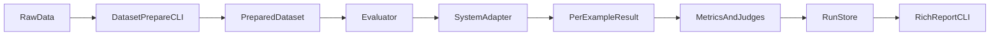

# Wiki-Memory-Bench MVP Architecture

## Goals
The MVP should provide a small, reproducible, local-first benchmark for **Markdown/Wiki-based memory systems** used by LLM agents.

The architecture is optimized for:

- fast iteration on a narrow problem,
- clear baseline comparisons,
- strong engineering quality for open-source and hiring-review use,
- future extensibility without dragging future complexity into v0.1.

## Scope of the MVP
The first version should support:

- datasets:
  - `locomo-mc10` (project-local normalized key backed by `locomo10.json`)
  - a tiny synthetic suite
- systems:
  - `full-context`
  - `bm25`
  - `vector-rag`
  - `markdown-summary`
  - `clipwiki`
- metrics:
  - answer correctness
  - citation precision
  - token usage / estimated cost
  - latency
  - patch correctness for synthetic maintenance tasks

The first version should **not** require:

- a hosted service,
- a vector database server,
- browser automation,
- a mandatory LLM judge,
- third-party system adapters to be fully implemented.

## Repository and Tooling Baseline
Implementation target:

- Python 3.11+
- `uv`
- Typer
- Pydantic
- Rich
- pytest

Current repository note:

- the repository currently targets Python 3.10 in `pyproject.toml` and `.python-version`
- the implementation phase should lift that to 3.11+ before shipping the benchmark

## System Overview



The core principle is:

1. **prepare once** into a normalized local dataset format,
2. **run any system** against the same prepared examples,
3. **score from artifacts**, not from ad hoc terminal logs.

## Package Layout
The package layout should follow the target tree below. Some modules are active in v0.1, while others are reserved for the next dataset wave.

```text
wiki_memory_bench/
  cli.py
  schemas.py
  datasets/
    base.py
    locomo_mc10.py
    longmemeval.py
    synthetic.py
  systems/
    base.py
    full_context.py
    bm25.py
    vector_rag.py
    markdown_summary.py
    clipwiki.py
  metrics/
    exact.py
    multiple_choice.py
    citation.py
    cost.py
    latency.py
  runner/
    evaluator.py
    run_store.py
    report.py
  clipwiki/
    compiler.py
    markdown_store.py
    patch.py
  judges/
    llm_judge.py
    deterministic.py
  utils/
    logging.py
    tokens.py
    paths.py
```

Status expectations:

- active in v0.1:
  - `datasets/base.py`
  - `datasets/locomo_mc10.py`
  - `datasets/synthetic.py`
  - all five baseline systems
  - deterministic metrics and report path
- reserved next:
  - `datasets/longmemeval.py`
  - `judges/llm_judge.py`
  - external adapter modules for third-party systems

## Core Data Model
The benchmark should use one normalized schema across datasets and systems.

### Prepared Example
Each prepared example should represent one evaluation unit with:

- `example_id`
- `dataset_name`
- `task_type`
- `history_clips`
- `question`
- `gold_answer`
- `choices` (optional)
- `gold_evidence` (optional)
- `gold_patch` (optional)
- `metadata`

### History Clip
Each clip is the atomic memory input:

- `clip_id`
- `conversation_id`
- `session_id`
- `turn_id`
- `speaker`
- `timestamp`
- `text`
- `source_ref`
- `tags`

Why clips matter:

- they are human-readable,
- they can be rendered into multiple memory backends,
- they make evidence and citation scoring possible.

### Task Types
The MVP should support a small task taxonomy:

- `qa_open`
- `qa_multiple_choice`
- `maintenance_patch`
- `stale_claim_resolution`

Not every dataset will populate every task type in v0.1.

### System Result
Every system should return the same top-level result shape:

- `example_id`
- `system_name`
- `answer_text` or `selected_choice`
- `citations`
- `retrieved_items`
- `proposed_patch` (optional)
- `token_usage`
- `latency_ms`
- `debug_artifacts`

This contract is more important than the internal implementation details of any system.

## Dataset Layer

### Dataset Responsibilities
Dataset adapters should:

1. load raw public or synthetic source data,
2. normalize it into `PreparedExample` records,
3. preserve timestamps and evidence references when available,
4. write a prepared local artifact with a stable manifest.

### Prepared Dataset Storage
Prepared data should live under a stable local layout such as:

```text
data/
  raw/
    <dataset_name>/
  prepared/
    <dataset_name>/
      manifest.json
      examples.jsonl
```

`manifest.json` should store:

- dataset version
- source location
- preparation parameters
- example count
- task distribution
- hash or preparation timestamp

### Dataset Modules

#### `datasets/locomo_mc10.py`
Responsibilities:

- read the official `locomo10.json`
- flatten QA annotations into per-question examples
- preserve session timestamps and dialog-level evidence IDs
- assign the project-local dataset key `locomo-mc10`

#### `datasets/synthetic.py`
Responsibilities:

- generate or load a tiny deterministic suite
- cover maintenance-specific tasks missing from public datasets
- emit explicit gold citations and gold patch outputs

#### `datasets/longmemeval.py`
Responsibilities for the next wave:

- normalize `LongMemEval-cleaned`
- preserve question type, evidence session IDs, and turn-level evidence
- optionally enable LLM-judge-backed scoring later

## System Adapter Layer

### Adapter Contract
Every system, whether built-in or external later, should satisfy one simple contract:

1. receive a `PreparedExample`,
2. build or update its memory representation from `history_clips`,
3. answer the task,
4. emit citations, resource stats, and optional maintenance output.

The minimal interface should look conceptually like this:

```python
class SystemAdapter(ABC):
    name: str
    supported_task_types: set[str]

    def setup(self, run_context: RunContext) -> None: ...
    def run_example(self, example: PreparedExample) -> SystemResult: ...
    def teardown(self) -> None: ...
```

The adapter is free to ingest clips incrementally inside `run_example`, but the benchmark should not force a more complex orchestration in v0.1.

### Built-In Baselines

#### `full-context`
- no indexing
- concatenates all clips directly into the reader prompt
- establishes an upper-bound baseline for "just stuff everything into context"

#### `bm25`
- lexical retrieval over clip or session text
- fast, local, no embedding dependency
- provides a transparent retrieval baseline

#### `vector-rag`
- embedding-based retrieval over the same normalized clips
- shares the same answer interface as `bm25`
- keeps the storage format local and simple

#### `markdown-summary`
- compiles clips into a condensed Markdown summary first
- tests whether summarization alone is enough without a richer wiki structure

#### `clipwiki`
- reference implementation of the benchmark's target problem
- compiles selected chat clips into a local Markdown wiki
- supports retrieval, citations, and controlled maintenance updates

### External Adapter Boundary
External systems such as `basic-memory`, `agentmemory`, `llm-wiki-skill`, `Mem0`, and `Zep` should be added **after** the benchmark core is stable.

The adapter boundary should avoid assuming:

- MCP availability
- a running daemon
- a cloud service
- a specific database

Instead, each future adapter should translate the normalized `PreparedExample` into whatever runtime that system expects.

## ClipWiki Reference Implementation
`ClipWiki` is the benchmark's reference memory system, not a full personal knowledge product.

### Components

#### `clipwiki/compiler.py`
- transforms chat clips into wiki pages
- groups clips into source pages, entity/topic pages, and lightweight indexes

#### `clipwiki/markdown_store.py`
- owns the local file layout for generated wiki pages
- handles page reads, writes, snapshots, and deterministic path resolution

#### `clipwiki/patch.py`
- defines the constrained patch format used in maintenance tasks
- applies and validates patches against the Markdown store

### Why a Constrained Patch Format
Free-form diffs are hard to score reliably. MVP should therefore use structured patch operations such as:

- `append_block`
- `replace_section`
- `mark_claim_stale`
- `insert_citation`

Patch correctness should be evaluated by:

1. applying the predicted patch to a canonical wiki snapshot,
2. comparing the resulting page content or structured claim state to the gold expectation,
3. rejecting malformed patches early.

This keeps maintenance evaluation reproducible without needing a full Markdown AST editor in v0.1.

## Metrics and Judges

### Deterministic Metrics
These belong in `metrics/` and `judges/deterministic.py`.

#### `metrics/exact.py`
- normalized exact-match or lightweight text normalization for open-answer tasks

#### `metrics/multiple_choice.py`
- accuracy for tasks with explicit choices

#### `metrics/citation.py`
- citation precision against gold evidence references
- optionally citation coverage when the dataset provides sufficient evidence labels

#### `metrics/cost.py`
- prompt and completion token accounting
- optional cost estimation by model pricing table

#### `metrics/latency.py`
- wall-clock timing at example and run level

#### `judges/deterministic.py`
- orchestrates deterministic scoring for answer, citation, and patch outcomes
- owns patch correctness checks in v0.1

### LLM Judge
`judges/llm_judge.py` is a phase-2 module for:

- LongMemEval-style semantic answer checking
- ambiguous citation interpretation
- potentially stale-claim reasoning beyond exact match

It should not be a required dependency for the MVP run loop.

## Runner, Run Store, and Reporting

### Evaluator
`runner/evaluator.py` should:

1. load prepared examples,
2. instantiate a system adapter,
3. execute examples sequentially in MVP,
4. score each result,
5. persist artifacts for later reporting.

### Run Store
Each run should produce a self-contained directory such as:

```text
runs/
  2026-04-19T120000Z-locomo-mc10-bm25/
    manifest.json
    predictions.jsonl
    metrics.json
    summary.md
    artifacts/
      retrieval/
      markdown/
      patches/
      debug/
```

`run_store.py` should also maintain a `runs/latest` pointer, ideally as a symlink when supported and a platform fallback otherwise.

### Reporting
`runner/report.py` should render:

- dataset and system metadata
- score tables
- token and latency summaries
- optional per-example error samples

Rich terminal output is enough for MVP. A web dashboard is unnecessary.

## CLI Shape
The CLI should stay very small:

```bash
wmb datasets list
wmb datasets prepare locomo-mc10 --limit 50
wmb run --dataset locomo-mc10 --system bm25 --limit 20
wmb run --dataset locomo-mc10 --system vector-rag --limit 20
wmb run --dataset locomo-mc10 --system clipwiki --limit 20
wmb report runs/latest
wmb synthetic generate --cases 100
wmb systems list
```

Recommended command groups:

- `wmb datasets ...`
- `wmb systems ...`
- `wmb synthetic ...`
- `wmb run ...`
- `wmb report ...`

## Architecture Principles

1. **Prepared data is the interface**, not raw public files.
2. **System outputs are scored from artifacts**, not prompt logs.
3. **Built-in baselines stay local and understandable**.
4. **ClipWiki defines the intended wiki-memory problem shape**.
5. **External adapters are first-class later, but not blockers now**.
6. **Patch tasks use constrained structured edits before arbitrary diffs**.
